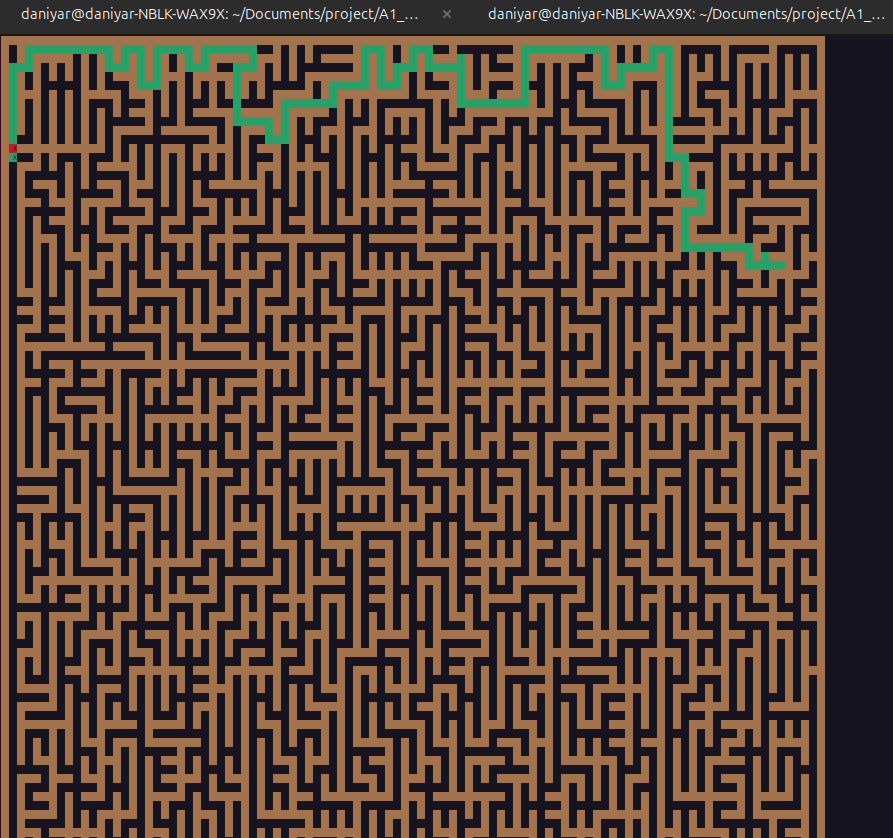

# S21_Maze project
### School 21 project for educational purposes. The program generates/loads mazes/caves, finds solutions to the current maze using BFS or machine learning algorithm
* Algorithms used in the project: Ellers algorithm for maze generation, Game of Life for cave generation, BFS for solving mazes, Q-learning for solving mazes using machine learning
* All instructions for using the program are in the program interface
  

